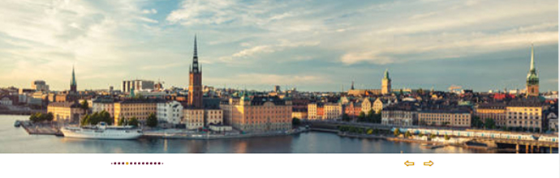
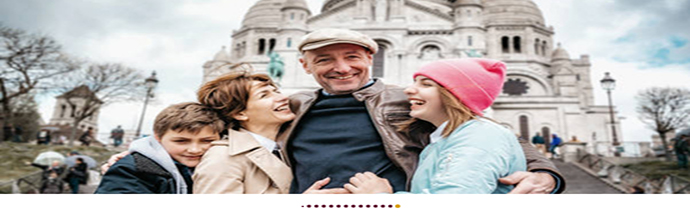
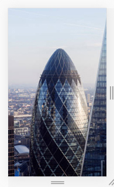

## Infinite carousel component for e-commerce with react


### Descriptions

A custom carousel component for your project. Supports css, scss, styled-components. To control slides, you can use buttons (prew, next), navigation points (dots), swipes. You can use them all together, or separately. Swipes will be enabled automatically if the device belongs to touch devices, if it is a mobile device, if it is a tablet.

There is support for choosing the type of animation (2 types), support for themes for controls.

It also reacts to the bandwidth of the Internet connection, which allows you to solve tasks such as turning off animations to eliminate the excessive use of the CPU resources of the user's device, which directly affects the speed and performance of your application.

##### At the moment, this is experimental functionality, and by default not all browsers are supported, it will be available in the browser chrome, opera of the latest versions. To work in firefox, the dom.netinfo.enabled in true setting must be enabled in the user's about: config. IE does not support this functionality.

---

### Using

```
import Carousel from "yourpath"

const YourCarousel = Carousel

const App = () => {
	return(
	<YourCarousel
		// support
	>
		// your elements with content
	</YourCarousel>
	)
}

export default App
```

### Using descriptions

You can add your own themes for buttons and dots.

```
<YourCarousel
	dotTheme={"your color"}
	activeDotTheme={"your color"}
	buttonTheme={"your color"}
>
	//your elements with content
</YourCarousel>
```

Also, if you need to, you can disable buttons, dots, or all together.

```
<YourCarousel
	dots={false}
	controls={false}
>
	//your elements with content
</YourCarousel>
```

##### With buttons and dots



##### With buttons


##### With dots



##### With swipe for device with sensor screen (mobile or tablet)

##### Together with swipes, you can add control , dots or buttons



##### You can customize different types of animation

```
<YourCarousel>
	animationType={"translate"} or {"scale"}
</YourCarousel>
```

##### !!! For animation, it is important that all content blocks are wrapped in a `<div> </div> ` element

```
<YourCarousel>
	<div>Your example content </div>
	<div>Your example content </div>
	<div>Your example content </div>
	<div>Your example content </div>
</YourCarousel>
```

### All settings and default settings

| options         | type    | default              | descriptions                                                  |
| --------------- | ------- | -------------------- | ------------------------------------------------------------- |
| dots            | boolean | true                 | if true initializes dots                                      |
| dotsTheme       | string  | "#ededed"            | add style for dots                                            |
| activeDotsTheme | string  | "rgb(140, 162, 255)" | add style for active dot                                      |
| controls        | boolean | true                 | if true initializes controls buttons                          |
| buttonTheme     | string  | "rgb(140, 162, 255)" | add style buttons                                             |
| animationType   | string  | "translate"          | you can choose the type of animation , translate-X or scale-X |
